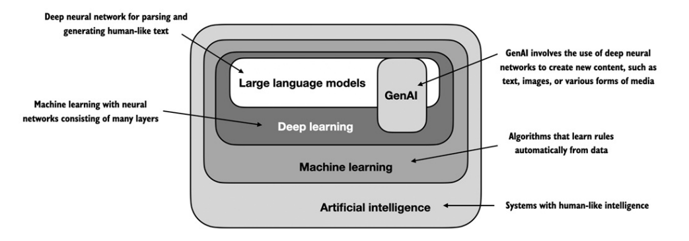
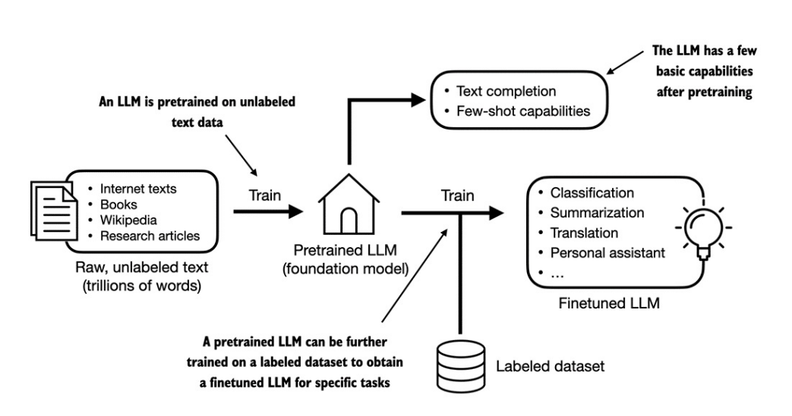
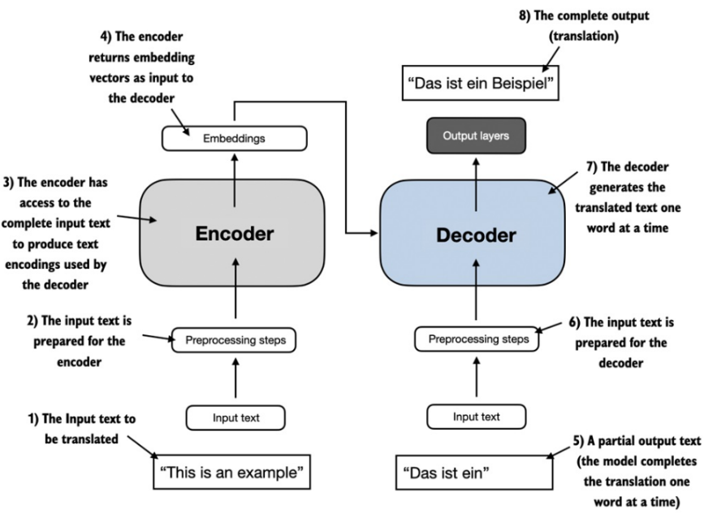
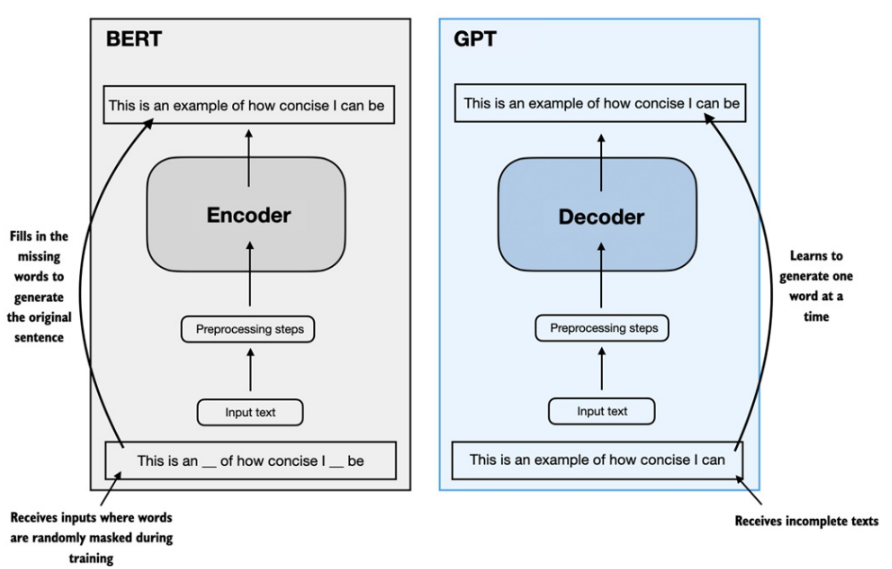
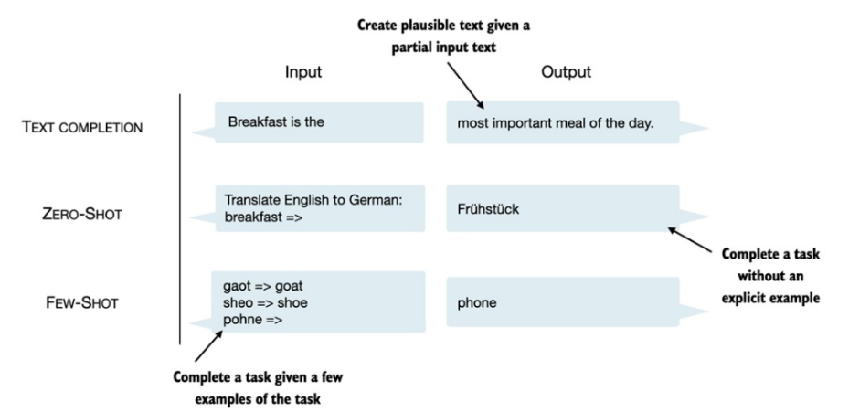

# Phase 0

## Grokking Machine Learning

### What is artificial intelligence?

- `ARTIFICIAL INTELLIGENCE` The set of all tasks in which computer can make decisions

### What is machine learning?

- `MACHINE LEARNING` The set of all tasks in which computer can make decisions based on data

### What is deep learning?

- `DEEP LEARNING` The field of machine learning that uses certain objects called neutral networks

### How machine make decisions?

- I don't know, but I know how humans make decisions

#### How do humans think?

1. Remember past situations that were similar to the current situation
2. Formulate a general rule
3. Use this rule to predict the outcome of the current situation

- Example: If you see a dog, you might remember that dogs are usually friendly and will wag their tails. You might then formulate a general rule that if an animal wags its tail, it is likely to be friendly. You can then use this rule to predict that the dog you see is likely to be friendly.

- Break it down into steps:

1. Remember the dog you saw in the past
2. Formulate a general rule that dogs are usually friendly and wag their tails
3. Use this rule to predict that the dog you see is likely to be friendly

## Build a Large Language Model (From Scratch)

### Understanding Large Language Models

#### What is an LLM?

- `LARGE LANGUAGE MODEL`: An LLM, a large language model, is a `neural network` designed to understand, generate, and respond to human-like text.

- The "large" in large language model refers to the vast amount of data and parameters that these models are trained on, enabling them to capture complex patterns in language.

- The algorithms used to implement AI are the focus of the field of machine learning, which is a subset of the broader field of artificial intelligence. Machine learning algorithms enable computers to learn from data and make predictions or decisions without being explicitly programmed for specific tasks.

#### Stages of building and using LLMs

- The general process of creating an LLM includes pretraining and finetuning.

- The term "pre" in "pretraining" refers to the initial phase where a model like an LLM is trained on a large, diverse dataset to develop a broad understanding of language. This pretrained model then serves as a foundational resource that can be further refined through finetuning, a process where the model is specifically trained on a narrower dataset that is more specific to particular tasks or domains.

- The first step in creating an LLM is to train it in on a large dataset of text sometimes referred to as `raw` text. This is called pretraining. During pretraining, the model learns to predict the next word in a sentence given the previous words. This helps the model learn the structure and patterns of language.

- Here, `raw` refers to the fact that this data is just regular text without any labeling information.

- After obtaining a pretrained LLM, we can then finetune it on a smaller dataset that is labeled for a specific task. For example, if we want to use the LLM for sentiment analysis, we would finetune it on a dataset of sentences that are labeled as positive, negative, or neutral. This allows the model to learn how to perform the specific task of sentiment analysis based on the general language understanding it gained during pretraining.

- The two most popular categories of finetuning LLMs include `instruction finetuning` and finetuning for `classification` tasks.

- `INSTRUCTION FINETUNING` involves training the LLM to follow specific instructions or prompts. For example, you might finetune an LLM to generate a summary of a given text when prompted with "Summarize the following text: ...". This type of finetuning helps the model learn how to respond to specific types of queries or commands.

- Finetuning for `classification` tasks involves training the LLM to categorize text into predefined classes. For example, you might finetune an LLM to classify movie reviews as positive or negative. In this case, the model learns to associate certain patterns in the text with specific labels, allowing it to make predictions about new, unseen data based on what it learned during finetuning.

#### Using LLMs for different tasks

- Most modern LLMs rely on a specific architecture called the `transformer` architecture, which is designed to handle sequential data like text. The transformer architecture allows LLMs to capture long-range dependencies in language, making them particularly effective for tasks like language modeling and text generation.

- A simplified depiction of the original transformer architecture, which is a deep learning model for language translation. The transformer consists of two parts, an encoder that processes the input text and produces an embedding representation (a numerical representation that captures many different factors in different dimensions) of the text that the decoder can use to generate the translated text one word at a time. Note that this figure shows the final stage of the translation process where the decoder has to generate only the final word ("Beispiel"), given the original input text ("This is an example") and a partially translated sentence ("Das ist ein"), to complete the translation.

- The transformer architecture depicted in Figure above consists of two submodules, an encoder and a decoder. The encoder module processes the input text and encodes it into a series of numerical representations or vectors that capture the contextual information of the input. Then, the decoder module takes these encoded vectors and generates the output text from them.

- In a translation task, the encoder would take the original sentence in the source language (e.g., "This is an example") and produce a set of encoded vectors that represent the meaning and context of that sentence. The decoder would then use these encoded vectors to generate the translated sentence in the target language (e.g., "Das ist ein Beispiel") one word at a time, starting with the first word ("Das") and using the previously generated words ("Das ist ein") along with the encoded vectors to predict the next word until it completes the translation.

- Both the encoder and decoder in the transformer architecture consist of multiple layers of self-attention and feedforward neural networks, which allow the model to capture complex relationships in the data and generate coherent and contextually relevant output.

- BERT (Bidirectional Encoder Representations from Transformers) is a popular LLM that uses only the encoder part of the transformer architecture. It is designed to understand the context of words in a sentence by looking at both the left and right context, making it particularly effective for tasks like question answering and sentiment analysis.

- GPT (Generative Pre-trained Transformer) is another popular LLM that uses only the decoder part of the transformer architecture. It is designed to generate coherent and contextually relevant text based on a given prompt, making it particularly effective for tasks like text generation and language modeling.

- A visual representation of the transformer's encoder and decoder submodules. On the
  left, the encoder segment exemplifies BERT-like LLMs, which focus on masked word prediction
  and are primarily used for tasks like text classification. On the right, the decoder segment
  showcases GPT-like LLMs, designed for generative tasks and producing coherent text sequences.

- In addition to text completion, GPT-like LLMs can solve various tasks based on their inputs without needing retraining, finetuning, or task-specific model architecture changes. Sometimes, it is helpful to provide examples of the target within the input, which is known as a few-shot setting. However, GPT-like LLMs are also capable of carrying out tasks without a specific example, which is called zero-shot setting.

