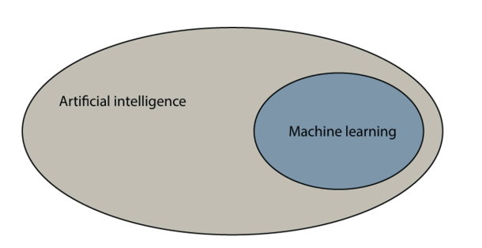
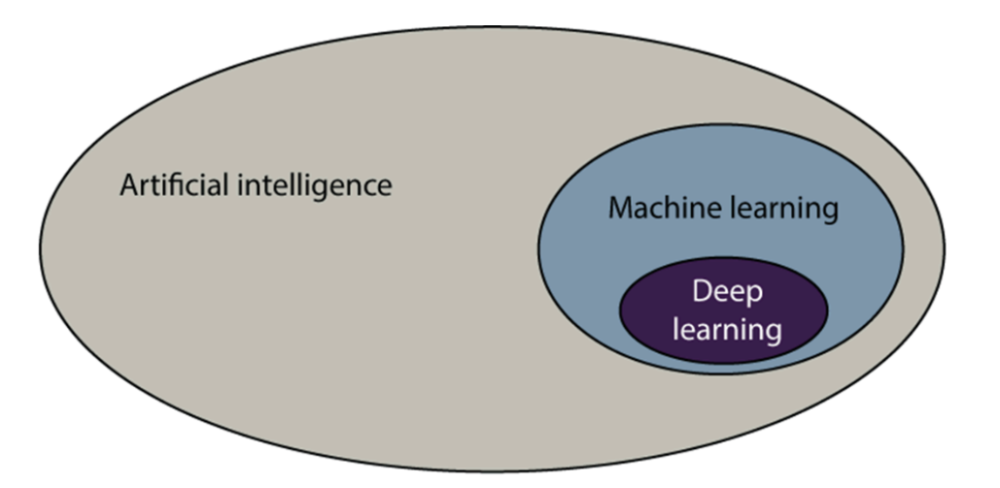

# Phase 1

## Grokking Machine Learning

### What is artificial intelligence?

- `ARTIFICIAL INTELLIGENCE` The set of all tasks in which computer can make decisions

### What is machine learning?

- `MACHINE LEARNING` The set of all tasks in which computer can make decisions based on data

### What is deep learning?

- `DEEP LEARNING` The field of machine learning that uses certain objects called neutral networks

### How machine make decisions?

- I don't know, but I know how humans make decisions

#### How do humans think?

1. Remember past situations that were similar to the current situation
2. Formulate a general rule
3. Use this rule to predict the outcome of the current situation

- Example: If you see a dog, you might remember that dogs are usually friendly and will wag their tails. You might then formulate a general rule that if an animal wags its tail, it is likely to be friendly. You can then use this rule to predict that the dog you see is likely to be friendly.

- Break it down into steps:
1. Remember the dog you saw in the past
2. Formulate a general rule that dogs are usually friendly and wag their tails
3. Use this rule to predict that the dog you see is likely to be friendly

